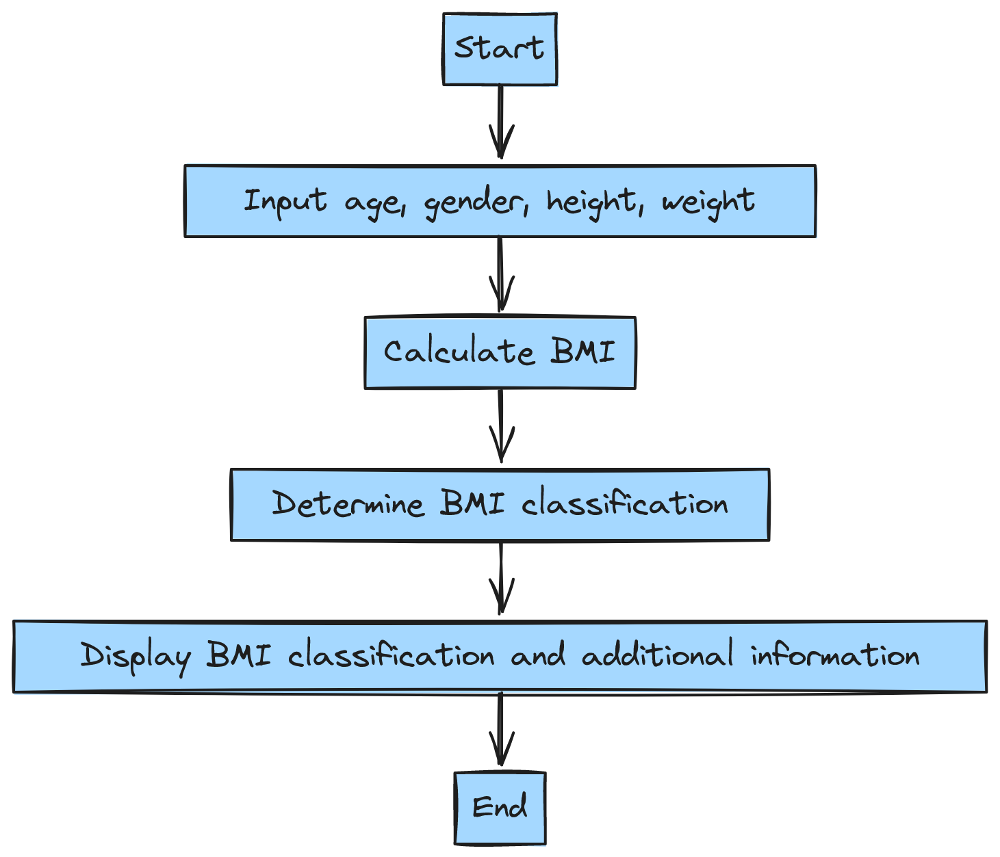
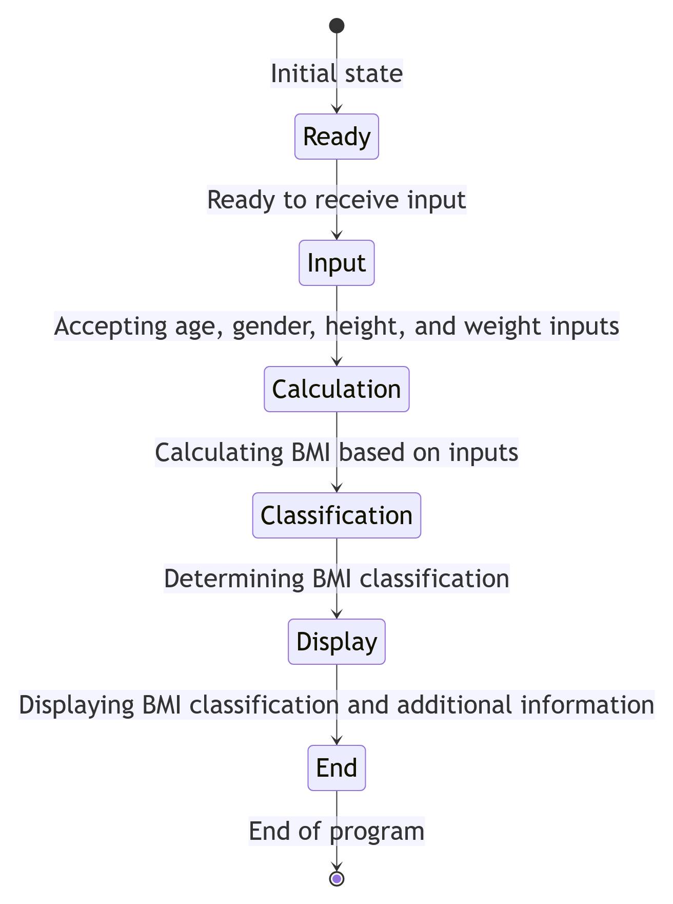
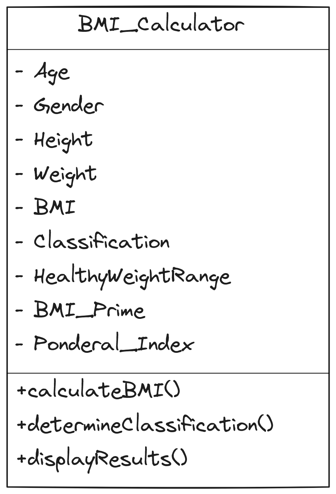

# BMI Calculator

This BMI (Body Mass Index) Calculator is a simple command-line tool that calculates BMI based on user input for weight and height. BMI is a measure of body fat based on height and weight that applies to adult men and women.

## Usage

To use the BMI Calculator, follow these steps:

1. Clone this repository to your local machine.
2. Navigate to the project directory.
3. Compile the source code on terminal or Command Prompt using "gcc src/* -Iinclude -o bmiCalculator".
4. Run the executable file to calculate BMI. 

# Flow Chart

# State Diagram

# Class Diagram

