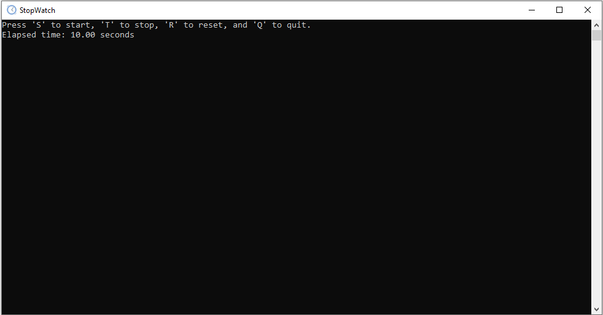

# Day-005: Stop-Timer with Custom Icon for exe file


#### Introduction
The Stop-Timer project is an enhancement of the previous Alarm Clock project from Day 004. In this project, we have developed a simple command-line Stopwatch application using C. The Stopwatch allows users to start, stop, reset, and display the elapsed time.

This project builds upon the concepts learned in the [Alarm Clock project](https://github.com/dohack/100Days100CProjects/tree/main/Day-004-Alarm-Clock), including time handling, user input validation, and basic application development in C.



## Features

- StopWatch inclusion of Custom Icon for exe file 
- Start the Stopwatch to measure elapsed time.
- Stop the Stopwatch to freeze the elapsed time display and start again.
- Reset the Stopwatch to zero.
- Display the elapsed time continuously in the console.

#### Project Structure
- **main.c**: Main program file that orchestrates the Stopwatch.
- **stopTimer.c**: Source file implementing Stopwatch functionalities.
- **stopTimer.h**: Header file containing function prototypes and structure definitions.
- **resource.rc**: Resource file for including the custom icon.

## Folder Structure

```plaintext
Day-005-Stop-Timer/
├── main.c
├── resource.o
├── resource.rc
├── stopWatch.c
├── stopWatch.exe
├── stopWatch.h
└── stopWatch.ico
└── stopWatch.png
```

#### How to Build
To build the Stop-Timer application on Windows, follow these steps:
1. Compile the source files and resource file using the following command:
   ```bash
   windres resource.rc -o resource.o
   gcc main.c stopTimer.c resource.o -o stopWatch
   ```

#### How to Run
After building the application, run it using the following command:
```bash
./stopTimer
```

#### Challenges Faced
Some potential challenges you might encounter while working on this project include:
- Implementing accurate time measurement.
- Managing user input for starting, stopping, and resetting the Stopwatch.
- Displaying the elapsed time in a user-friendly format.

## Challenges for You

- Implement a graphical user interface (GUI) for the Stopwatch.
- Add lap timing functionality to the Stopwatch.
- Include options for saving and loading Stopwatch sessions.

#### GitHub Repository
Explore the main GitHub repository for more projects and updates:
[https://github.com/dohack/100Days100CProjects/](https://github.com/dohack/100Days100CProjects/)

#### LinkedIn Profile
Connect with me on LinkedIn:
[Ankit Kumar - LinkedIn](https://www.linkedin.com/in/ankit-kumar-4585b5284/)

This project contributes to the ongoing 100 Days, 100 C Projects challenge. Stay tuned for more exciting projects and challenges!
