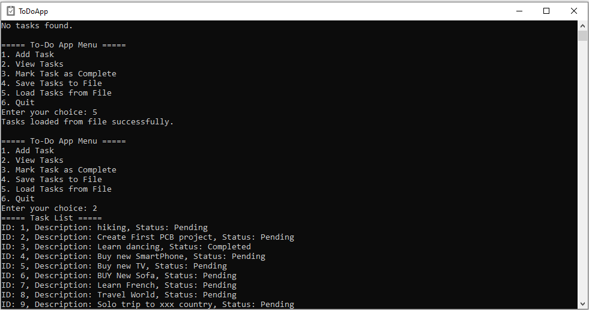

# Day-006: Command-Line To-Do App in C


#### Introduction
The Command-Line To-Do App project is a simple yet effective implementation of a to-do list application using the C programming language. The app allows users to manage tasks by adding, viewing, marking as complete, saving to a file, and loading from a file. This project aims to reinforce core programming concepts such as structures, file handling, user input, and modular programming in C.



## Features

- Create a to-do list by adding tasks with descriptions and statuses.
- View all tasks in the to-do list.
- Mark tasks as complete to track progress.
- Save the to-do list to a file for persistence.
- Load tasks from a file to resume working on tasks.

#### Project Structure
- **src/main.c**: Main program file that handles user interactions and menu options.
- **src/toDoApp.c**: Source file containing implementations of to-do app functionalities.
- **include/toDoApp.h**: Header file containing function prototypes and structure definitions.
- **app_data.csv**: CSV file used to save and load tasks.
- **Makefile**: Makefile for building the project.

## Folder Structure

```plaintext
Command-Line-To-Do-App/
├── src/
│   ├── main.c
│   └── toDoApp.c
├── include/
│   └── toDoApp.h
├── app_data.csv
├── Makefile
├── todoApp.ico
└── todoApp.png
```

#### How to Build Using Makefile
To build the Command-Line To-Do App using the Makefile, follow these steps:
1. Open a terminal or command prompt.
2. Navigate to the directory containing the Makefile and source files.
3. Run the following command to build the project:

   ```bash
   make
   ```

   This command will compile the source files and generate the executable `ToDoApp` in the build directory.

#### How to Run
After building the application, run it using the following command:
```bash
./build/ToDoApp
```

#### Challenges Faced
Some potential challenges you might encounter while working on this project include:
- Implementing file handling for saving and loading tasks.
- Managing user input for various menu options.
- Validating user input to prevent errors and ensure correctness.

## Challenges for You

- Add sorting functionality to sort tasks based on ID or status.
- Implement editing and deleting tasks from the to-do list.
- Create a user-friendly interface with colored output and clearer instructions.
- ADD GUI

#### GitHub Repository
Explore my GitHub repository for more projects and updates:
[https://github.com/dohack](https://github.com/dohack)

#### LinkedIn Profile
Connect with me on LinkedIn:
[Ankit Kumar - LinkedIn](https://www.linkedin.com/in/ankit-kumar-4585b5284/)

This project contributes to the ongoing [100 Days, 100 C Projects challenge](https://github.com/dohack/100Days100CProjects/). Stay tuned for more exciting projects and challenges!

[ICON by ICON8](https://icons8.com/icon/6650/inspection)