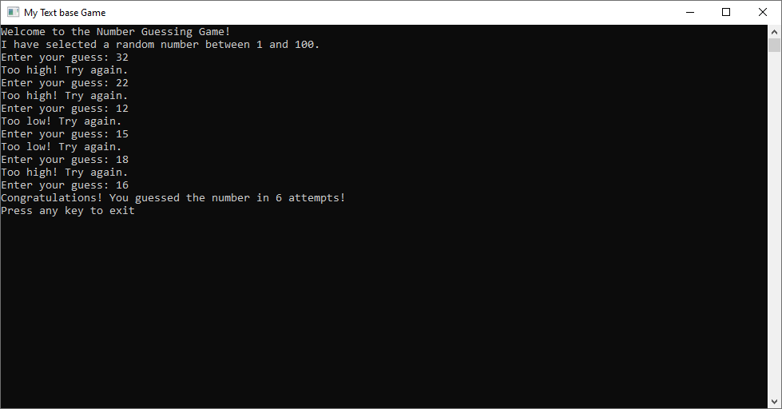

# Text-Based Number Guessing Game

Welcome to the Text-Based Number Guessing Game! This is a simple game implemented in C where the player tries to guess a randomly generated number.




## How to Play

1. **Clone the Repository**: Clone this repository to your local machine.

    ```bash
    git clone <repository_url>
    ```

2. **Compile the Game**: Navigate to the project directory and compile the game using a C compiler like gcc.

    ```bash
    cd text-based-number-guessing-game
    gcc main.c textGame.c -o textGame
    ```

3. **Run the Game**: Execute the compiled binary to start the game.

    ```bash
    ./textGame
    ```

4. **Guess the Number**: You will be prompted to guess a randomly generated number between 1 and 100. Enter your guess and press Enter.

5. **Winning or Losing**: If your guess is correct, you win the game! If not, you'll be given hints to guide you closer to the correct answer. Keep guessing until you get it right!

6. **Play Again**: After winning or losing, you'll have the option to play again or exit the game.

## Features

- **Random Number Generation**: The game generates a random number between 1 and 100 for the player to guess.
- **User Input**: Uses standard input to receive the player's guesses.
- **Hints**: Provides hints to guide the player towards the correct answer.
- **Play Again Option**: Allows the player to play multiple rounds of the game.

## File Structure

- **main.c**: Contains the main function where the game is initialized and started.
- **textGame.c**: Implements the game logic including random number generation, user input, and providing hints.
- **textGame.h**: Header file declaring the functions used in textGame.c.

## Contributing

Contributions are welcome! If you have any ideas for improvements or find any bugs, feel free to open an issue or submit a pull request.
