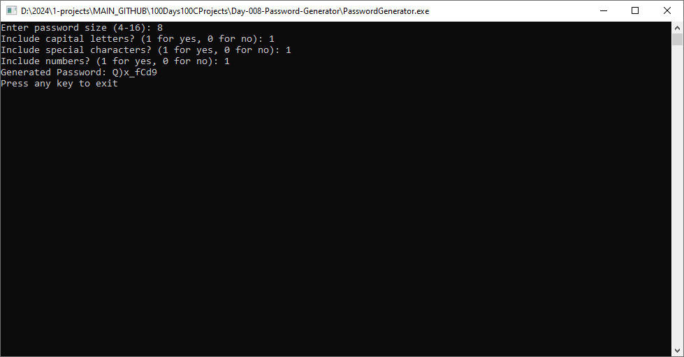

# Day-008-Password-Generator

## Overview

Day-008-Password-Generator is a simple command-line application written in C that generates random passwords based on user-defined parameters such as length, inclusion of capital letters, special characters, and numbers.



## Features

- Allows the user to specify the length of the password (between 4 and 16 characters).
- Provides options to include capital letters, special characters, and numbers in the password generation process.
- Generates a random password based on the user's input.
- Offers the option to generate a new password based on previous settings, start with new settings, or exit the program.

## Usage

1. **Compilation**: Compile the program using a C compiler. For example, using GCC:
   
    ```
    gcc main.c passGen.c -o PasswordGenerator
    ```

2. **Execution**: Run the compiled program:

    ```
    ./PasswordGenerator
    ```

3. **Usage Instructions**:
   
    - Enter the desired password size when prompted (between 4 and 16).
    - Respond to the prompts to include capital letters, special characters, and numbers in the password.
    - After generating a password, the program presents options:
      - Press 'A' or 'a' to generate a new password based on previous settings.
      - Press 'S' or 's' to start with new settings.
      - Press 'Q' or 'q' to exit the program.

## Challenges Faced

- Ensuring valid input from the user for password parameters.
- Handling options for generating new passwords and exiting the program.

## Challenges for Improvement

- Implementing more sophisticated password generation algorithms.
- Enhancing user interface and interaction.
- Improving error handling and input validation.

## Future Features

- Password strength evaluation.
- Customizable character sets for password generation.
- Option to save generated passwords to a file.
- Graphical user interface (GUI) for easier usage.
- Integration with password management tools.

## Credits

This project is part of the "100 Days, 100 C Applications" challenge. You can find the complete list of projects [here](https://github.com/dohack/100Days100CProjects).
