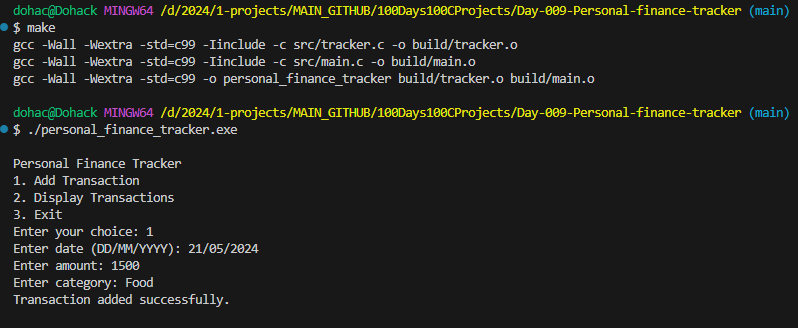

# Personal Finance Tracker



## Overview
The Personal Finance Tracker is a simple C program designed to help users track their financial transactions. It allows users to add new transactions, categorize them, and view their transaction history.

## Challenges
- Managing input validation to ensure accurate data entry.
- Implementing robust error handling to gracefully handle unexpected user inputs or file operations.
- Designing an intuitive user interface for interacting with the program.
- Optimizing memory usage and performance for large transaction datasets.

## Folder Structure
```
personal-finance-tracker/
│
├── build/
│   ├── (Compiled executable and object files)
│
├── include/
│   ├── tracker.h (Header file containing structure definition and function prototypes)
│
├── src/
│   ├── main.c (Main program file)
│   ├── tracker.c (Implementation of transaction management functions)
│
├── README.md (Project documentation)
├── Makefile (Build automation script)
├── personal-finance-tracker.PNG (Overview image)
```

## Features to Add
- Date-based filtering and sorting of transactions.
- Support for multiple user accounts or profiles.
- Exporting transaction data to CSV or other file formats.
- Generating summary reports or visualizations of spending patterns.
- Implementing data encryption and user authentication for enhanced security.

## Getting Started
1. Clone this repository to your local machine.
2. Navigate to the project directory.
3. Compile the program using `make`.
4. Run the compiled executable to launch the Personal Finance Tracker.

## Usage
- Use the menu options to add new transactions, view transaction history, or exit the program.
- Follow the on-screen prompts to enter transaction details such as date, amount, and category.


